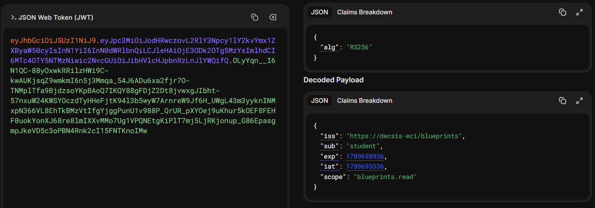
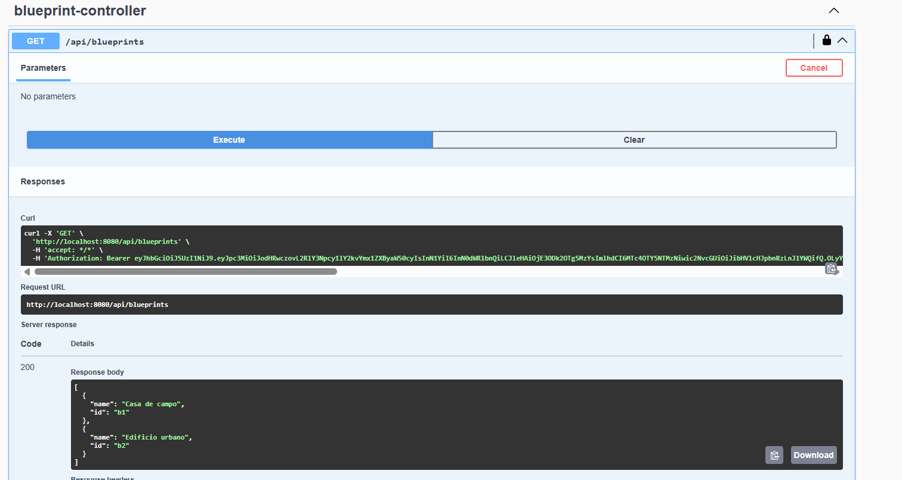
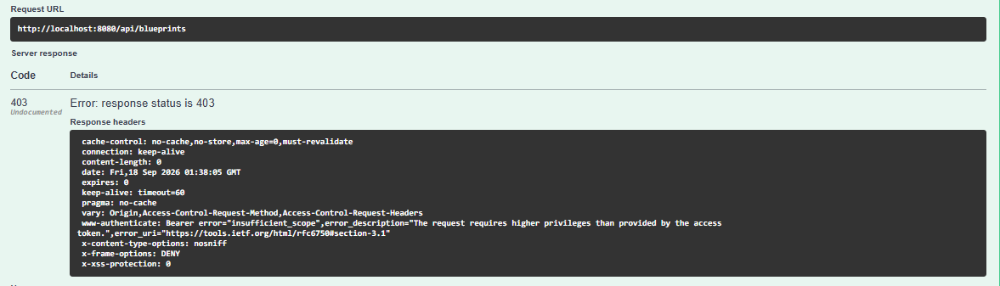
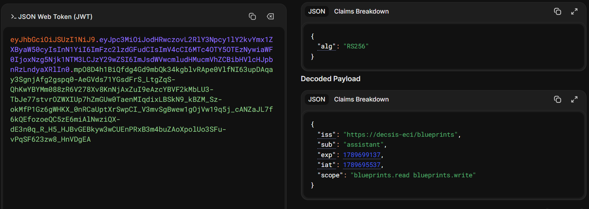
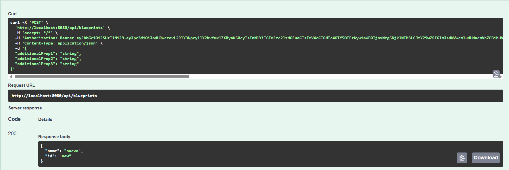
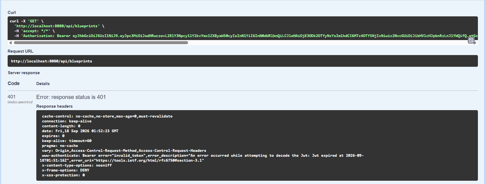

# Escuela Colombiana de Ingeniería Julio Garavito
## Arquitectura de Software – ARSW
### Laboratorio – Parte 2: BluePrints API con Seguridad JWT (OAuth 2.0)


## Participantes
### - Jeyder Nicolay León Lancheros
### - Juan Camilo Cristancho Velasquez

# Actividades propuestas
## 1. Revisar el código de configuración de seguridad (`SecurityConfig`) e identificar cómo se definen los endpoints públicos y protegidos.

En la clase SecurityConfig se definen todos los aspectos en temas de seguridad de endpoints, decodificacion de contraseñas y de tokens JWT. Para entender como
funciona vamos a separarla por bloques.


#### Seguridad de EndPoints

Este metodo define las reglas de seguridad de nuestra api, cada vez que se arranca la aplicacion se ejecuta y define 
quien puede pasar, quien no y con qué restricciones.
```java
  @Bean
    public SecurityFilterChain filterChain(HttpSecurity http) throws Exception {
        http
            .csrf(csrf -> csrf.disable())
            .authorizeHttpRequests(auth -> auth
                .requestMatchers("/actuator/health", "/auth/login").permitAll()
                .requestMatchers("/v3/api-docs/**", "/swagger-ui/**", "/swagger-ui.html").permitAll()
                .requestMatchers("/api/**").hasAnyAuthority("SCOPE_blueprints.read", "SCOPE_blueprints.write")
                .anyRequest().authenticated()
            )
            .oauth2ResourceServer(oauth2 -> oauth2.jwt(Customizer.withDefaults()));
        return http.build();
    }
  ```
Para empezar, desactiva CSRF, ya que como usamos tokens para autenticacion no aplica (CSRF usa cookies) por eso lo desactivamos.
```java
.csrf(csrf -> csrf.disable())
  ```

Luego empiezan todas las reglas de seguridad de nuestra api, aca definimos las rutas permitidas y para quienes lo están.

```java
.authorizeHttpRequests(auth -> auth
```

Empezamos definiendo las rutas públicas, las cuales son health que sirve como endpoint de monitoreo de que la api esté levantada, 
y el endpoint de login, el cual necesitamos que sea público para que todo el mundo se pueda autenticar e ingresar a los endpoints protegidos.
```java
.requestMatchers("/actuator/health", "/auth/login").permitAll()
```
Seguimos con la documentacion en Swagger, la cual para visualizar los endpoints de la mejor manera es necesario que sea pública,
asi podemos probar los demás endpoints publicos y protegidos.
```java
.requestMatchers("/v3/api-docs/**", "/swagger-ui/**", "/swagger-ui.html").permitAll()
```
Para los endpoints protegidos, aplica para todo los endpoints bajo /api/** que tengan al menos uno de los dos scopes disponibles

Scopes: Son permisos definidos que viajan a traves del token JWT y que al momento de autenticar le da permisos al usuario, para este 
ejercicio hay permisos de lectura y escritura.
```java
.requestMatchers("/api/**").hasAnyAuthority("SCOPE_blueprints.read", "SCOPE_blueprints.write")
```
```java
```


## 2. Explorar el flujo de login y analizar las claims del JWT emitido.

Vamos a analizar el endpoint encargado del login en nuestra api, el AuthController

```java
@PostMapping("/login")
    public ResponseEntity<?> login(@RequestBody LoginRequest req) {
        if (!userService.isValid(req.username(), req.password())) {
            return ResponseEntity.status(401).body(Map.of("error", "invalid_credentials"));
        }

        Instant now = Instant.now();
        long ttl = props.tokenTtlSeconds() != null ? props.tokenTtlSeconds() : 3600;
        Instant exp = now.plusSeconds(ttl);

        String scope = "blueprints.read blueprints.write";

        JwtClaimsSet claims = JwtClaimsSet.builder()
                .issuer(props.issuer())
                .issuedAt(now)
                .expiresAt(exp)
                .subject(req.username())
                .claim("scope", scope)
                .build();

        JwsHeader jws = JwsHeader.with(() -> "RS256").build();
        String token = this.encoder.encode(JwtEncoderParameters.from(jws, claims)).getTokenValue();

        return ResponseEntity.ok(new TokenResponse(token, "Bearer", ttl));
    }
```

Primero que todo, verifica las credenciales, si no son válidas botan un error 401, por credenciales no autorizadas.
```java
if (!userService.isValid(req.username(), req.password())) {
            return ResponseEntity.status(401).body(Map.of("error", "invalid_credentials"));
        }
```

En este bloque, calcula el ttl (tiempo de expiracion del token) y lo compara con la hora exacta de la peticion hecha por el servidor,
compara los tiempos y determina si el ttl sigue vigente o ya expiro, si es asi botaria otro error.
```java
Instant now = Instant.now();
long ttl = props.tokenTtlSeconds() != null ? props.tokenTtlSeconds() : 3600;
Instant exp = now.plusSeconds(ttl);
```

Luego, se asignan los scopes al usuario, como estan en una sola linea cada usuario recibe automaticamente ambos scopes.

```java
String scope = "blueprints.read blueprints.write";
```

Finalizando, se construyen los claims, tenemos en total 5 claims.
1. iss: Quien emitio el token, en nuestra api el claim normalmente es self, ya que solo hay un unico emisor de los tokens.
2. iat: la fecha exacta de cuando se emitio el token.
3. exp: cuando deja de ser válido el token, se define sumandole el ttl a la hora actual.
4. sub: es el nombre del usuario a quien pertenece el token, sirve para identificar al usuario
5. scope: son los permisos que maneja el usuario.
```java
JwtClaimsSet claims = JwtClaimsSet.builder()
                .issuer(props.issuer())
                .issuedAt(now)
                .expiresAt(exp)
                .subject(req.username())
                .claim("scope", scope)
                .build();
```
Por último, se firma el token con una clave de encriptacion RSA RS256, lo convierte en un string y por ultimo
 devuelve el token acompañado con el Bearer y el ttl.
```java
JwsHeader jws = JwsHeader.with(() -> "RS256").build();
String token = this.encoder.encode(JwtEncoderParameters.from(jws, claims)).getTokenValue();

return ResponseEntity.ok(new TokenResponse(token, "Bearer", ttl));
```

## 3. Extender los scopes (`blueprints.read`, `blueprints.write`) para controlar otros endpoints de la API, del laboratorio P1 trabajado.

En el punto anterior, identificamos una problematica importante, y es que ambos usuarios, tanto el student como el assistant tienen los mismos scopes, 
por lo cual ambos tienen acceso a todos los endpoints, para separar estos permisos debemos empezar haciendo varios cambios.

Antes, el Map de usuarios solo guardaba el hash de la contraseña, y el `AuthController` asignaba el mismo scope fijo a
cualquier usuario que iniciara sesión. Se modificó el servicio para que cada usuario tenga también sus propios permisos:

```java
public record AppUser(String passwordHash, String scopes) {}

private final Map<String, AppUser> users;

public InMemoryUserService(PasswordEncoder encoder) {
    this.encoder = encoder;
    this.users = Map.of(
        "student",   new AppUser(encoder.encode("student123"),   "blueprints.read"),
        "assistant", new AppUser(encoder.encode("assistant123"), "blueprints.read blueprints.write")
    );
}

public String scopesOf(String username) {
    AppUser u = users.get(username);
    return u == null ? "" : u.scopes();
}
```

El usuario student solo recibe el scope `blueprints.read`, mientras que assistant recibe `blueprints.read blueprints.write`.
Esto convierte al scope en información real de autorización por usuario, en vez de un valor igual para todos.

```java
String scope = userService.scopesOf(req.username());
```

Antes esta línea era `String scope = "blueprints.read blueprints.write";`, fija sin importar quién hiciera login. Con el cambio,
el claim `scope` del JWT emitido varía según el usuario autenticado. Se verificó decodificando ambos tokens en jwt.io: el de
`student` muestra `"scope": "blueprints.read"` y el de `assistant` muestra `"scope": "blueprints.read blueprints.write"`.


Luego, cambiamos la clase SecurityConfig, en la cual separamos los permisos de cada scope de acuerdo a su verbo HTTP, por ejemplo, para verbos
 como GET, el scope .read es perfecto, y para verbos POST o PUT, el scope es perfecto para modificar o crear planos.

```java
.authorizeHttpRequests(auth -> auth
    .requestMatchers("/actuator/health", "/auth/login").permitAll()
    .requestMatchers("/v3/api-docs/**", "/swagger-ui/**", "/swagger-ui.html").permitAll()
    .requestMatchers(HttpMethod.GET, "/api/**")
        .hasAuthority("SCOPE_blueprints.read")
    .requestMatchers(HttpMethod.POST, "/api/**")
        .hasAuthority("SCOPE_blueprints.write")
    .requestMatchers(HttpMethod.PUT, "/api/**")
        .hasAuthority("SCOPE_blueprints.write")
    .anyRequest().authenticated()
)
```

Para mayor seguridad en nuestra api, usamos las anotaciones de seguridad en el controller de la P1, de tal manera que verifica que esté usando el scope adecuado, 
esto sirve como una doble proteccion, protegiendo el metodo en sí, sin importar en que ruta se invoque.

```java
@PreAuthorize("hasAuthority('SCOPE_blueprints.read')")
@GetMapping
public ResponseEntity<ApiResponse<Set<Blueprint>>> getAll() { ... }

@PreAuthorize("hasAuthority('SCOPE_blueprints.write')")
@PostMapping
public ResponseEntity<ApiResponse<?>> add(@Valid @RequestBody NewBlueprintRequest req) { ... }

@PreAuthorize("hasAuthority('SCOPE_blueprints.write')")
@PutMapping("/{author}/{bpname}/points")
public ResponseEntity<ApiResponse<?>> addPoint(...) { ... }
```

#### Resultados esperados
 Usuario | Petición | Resultado esperado | Resultado obtenido |
|---|---|---|---|
| `student` | `GET /api/blueprints` | 200 | 200 |
| `student` | `POST /api/blueprints` | 403 | 403 |
| `assistant` | `POST /api/blueprints` | 200/201 | 201 |

#### Evidencias

Usamos primero las credenciales de student, usamos jwt.io para verificar sus claims y verificar que solo tiene el scope de lectura



Luego probamos con el endpoint de GET en blueprints. Dando como resultado una respuesta HTTP 200



Y al momento de probar con el endpoint de POST, nos damos cuenta que funcionan los scopes ya que nos arroja un error 403 por acceso no autorizado



Luego pasamos a probar el usuario assistand, en el que como definimos antes, tiene ambos scopes.



por último, para probarlo, en el metodo POST donde el usuario student no pudo usar, este nos da una respuesta exitosa.


## 4. Modificar el tiempo de expiración del token y observar el efecto.

Vamos a probar cambiando el tiempo del ttl el cual se encuenta en application.yml y lo cambiamos a 60 segundos
```
blueprints:
  security:
    issuer: "https://decsis-eci/blueprints"
    token-ttl-seconds: 60
```

Usando las credenciales de student, al momento de hacer un GET /api/blueprints todo funciona adecuadamente; sin embargo, al pasar un minuto, 
nos aparece el error 401, confirmando asi que el token tiene una expiración y cada vez que se hace un llamado a la API, este revisa si ya expiro.



## 5. Documentar en Swagger los endpoints de autenticación y de negocio.